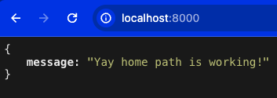

# Nodejs Backend API (23-9 cohort)

# Pre-requisites

- Install [Node.js](https://nodejs.org/en/) version 20.2.0

# Getting started

- On your computer, navigate to a location where you want to clone this repository

- Clone the repository

```
% git clone  https://github.com/<github_username>/<project_name>
```

> Example: https://github.com/agaparkg/nodejs-demo-backend-23-9

- Install dependencies

```
% cd <project_name>

% npm install
```

- Run the project

```
% npm start
```

Navigate to `http://localhost:8000` to see the output  


- Additional routes

  ```
  GET - /users
  GET - /users/:id (req.params.id)
  POST - /users (provide the data in the body)
  DELETE - /users/:id (req.params.id)
  PATCH - /users/:id (req.params.id & provide the data in the body)
  ```

- API Document endpoints

  In progress... Stay tuned!
